# Simple-LDM:简易LDM进行手写数字生成

## 环境配置

前期采用的是自己的游戏本，后面由于太难跑改用autodl云平台，配置如下：

GPU: RTX 4090(24GB) * 1

CPU: 16 vCPU Intel(R) Xeon(R) Gold 6430

内存:120GB

Python:3.12

安装jittor

```
python -m pip install jittor
```

在本项目中，我们采用pytorch_fid来计算FID指标，pytorch_fid安装如下所示：

```
python -m pip install pytorch-fid
```


## 数据准备

数据采用了MNIST手写数字数据集，采用PyTorch时，加载方式如下：

```python

from torchvision import datasets, transforms
from torch.utils.data import DataLoader

BATCH_SIZE = 128

transform = transforms.Compose([
        transforms.ToTensor(),
        transforms.Resize((32, 32))
    ])

train_dataset = datasets.MNIST(
        root='./data',
        train=True,
        download=True,
        transform=transform
    )

dataloader = DataLoader(
        train_dataset,
        batch_size=BATCH_SIZE,
        shuffle=True,
        num_workers=4,
        pin_memory=True
    )
```

采用Jittor时，加载方式如下，和PyTorch相比，Jittor加载数据集时不需要额外的Dataloader，其transform方法中也不需要ToTensor()方法：

```python

# 准备MNIST数据集
trans = transform.Compose([
        transform.Resize((32, 32))  # 调整为统一尺寸
    ])

dataloader = dataset.MNIST(
        data_root='./data/MNIST/raw/',
        train=True,
        download=False,
        transform=trans
    ).set_attrs(batch_size=128, shuffle=True)

```

## 训练
训练脚本存储在每个框架版本的“script”下面，启动方式为：
```bash
python script/train_mnist.py //DDPM
python script/train_mnist_vae.py //VAE
python script/train_mnist_ldm.py //LDM
```

## 测试

这里主要做的是检验图片的生成效果

```bash
python script/tst_mnist.py //DDPM
python script/tst_mnist_ldm.py //LDM
```


## loss

对UNet损失的计算基于均方误差：

$ \text{MSE} = \frac{1}{n} \sum_{i=1}^{n} (y_i - \hat{y}_i)^2 $

而对于变分自编码器(Variational Autoencoder, VAE)，损失则是基于kl散度和

$ \text{VAE Loss} = \text{Recon Loss} + \lambda \cdot \text{KL Loss} $

其中，重建损失（Recon Loss）如下：

$ \text{Recon Loss} = \frac{1}{N} \sum_{i=1}^{N} (x_i - \hat{x}_i)^2 $

KL散度如下所示：

$ \text{KL Loss} = -\frac{1}{N} \sum_{i=1}^{N} \left(1 + \log \sigma_i^2 - \mu_i^2 - \sigma_i^2\right) $

KL散度这一项还加上了一个KL权重$ \lambda $，其通常取$ 10^{-4} $。


### DDPM
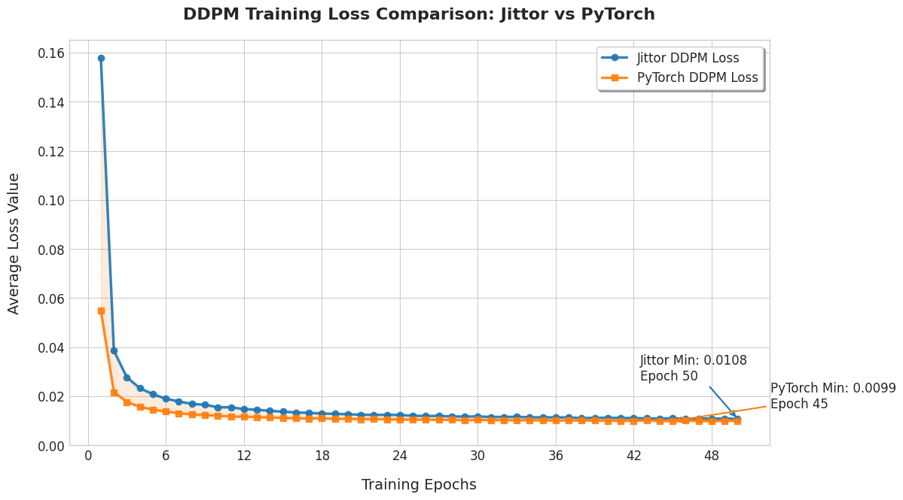


### VAE
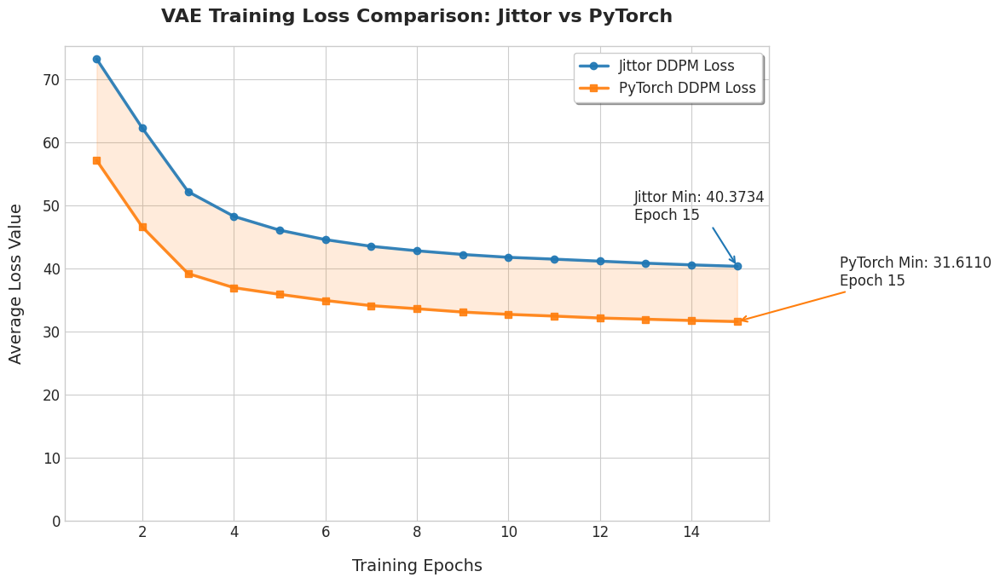


### LDM
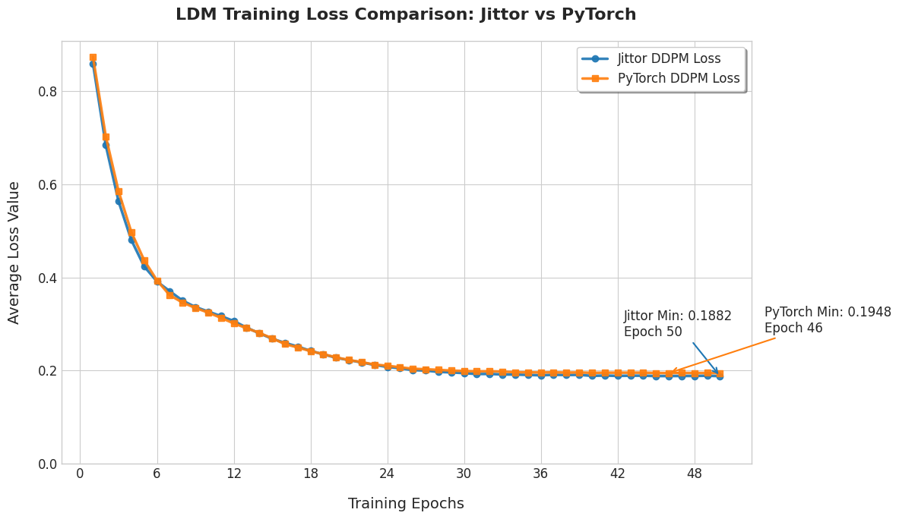

### 总结

## 性能：推理时长（10000张生成图片）
在计算FID的时候，我们需要大量的生成图片来计算和真实分布之间的距离，在生成过程中，我记录了不同方法，不同框架的推理用时，在生成数量均为10000的情况下，推理速度表现为：

|  | pytorch | jittor |
| :----- | :------: | -----: |
| ddpm | 26m37s | 37m11s |
| ldm | 3m39s | 4m04s |

## 性能：FID

FID的计算通过下面的脚本实现：

```
python script/tst_mnist_fid.py
python script/tst_mnist_ldm_fid.py
```

注意，本项目jittor版本的fid计算也是基于pytorch-fid来实现的，因此在jittor生成图像之后还需要再输入命令：

```
cd path/to/your/image
python -m pytorch_fid ./fake ./real
```

|  | pytorch | jittor |
| :----- | :------: | -----: |
| ddpm | 32.66 | 42.18 |
| ldm | 128.87 | 112.82 |


## 扩散过程

### DDPM

#### pytorch
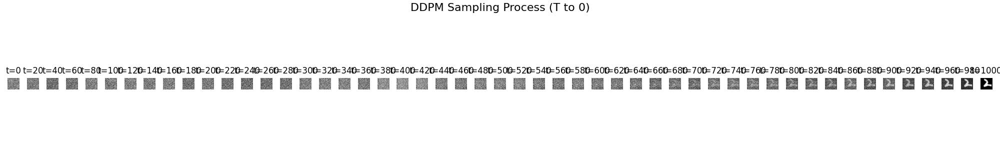
#### jittor
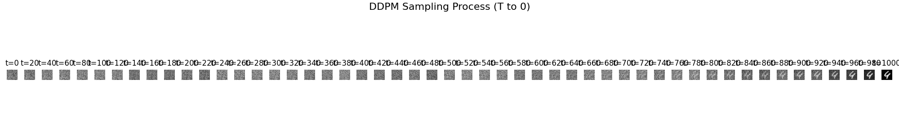
### LDM

#### pytorch
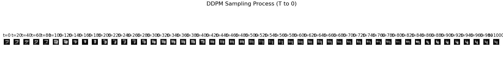
#### jittor
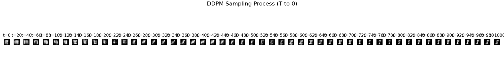

## 生成效果

### DDPM

#### pytorch
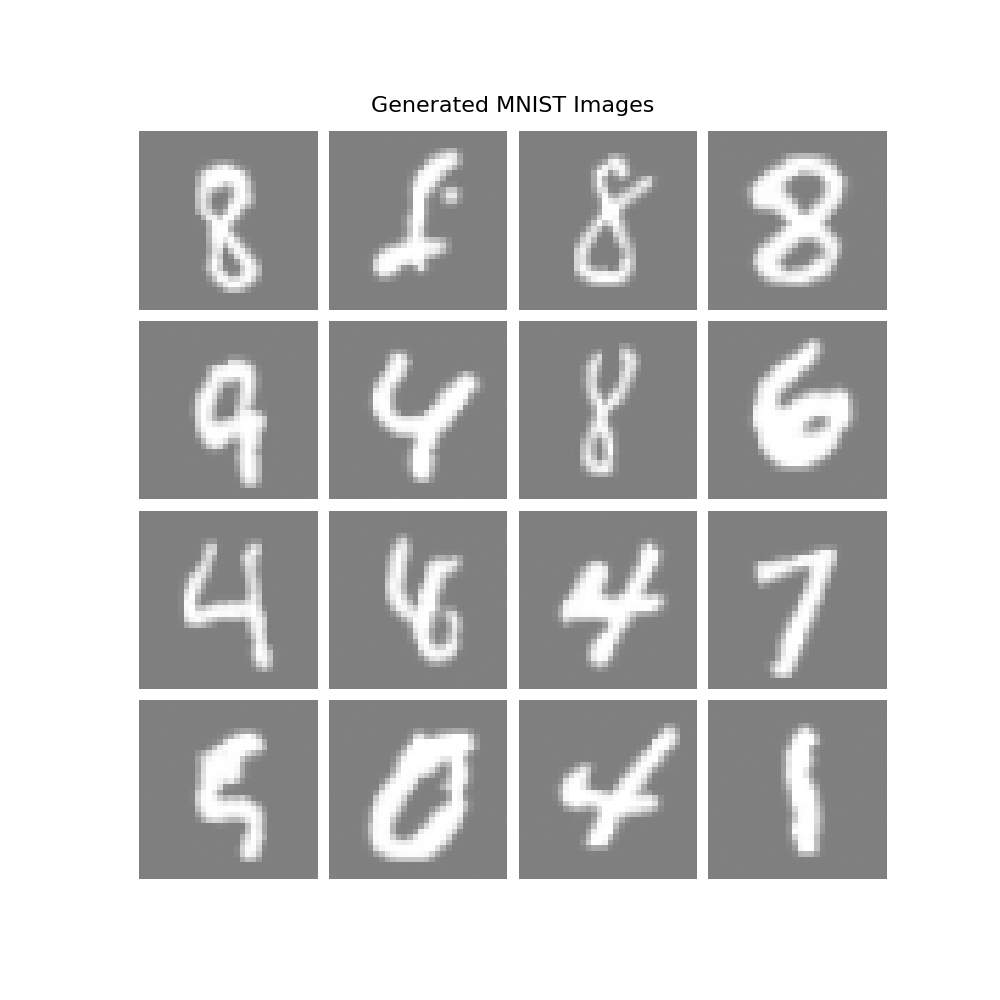
#### jittor
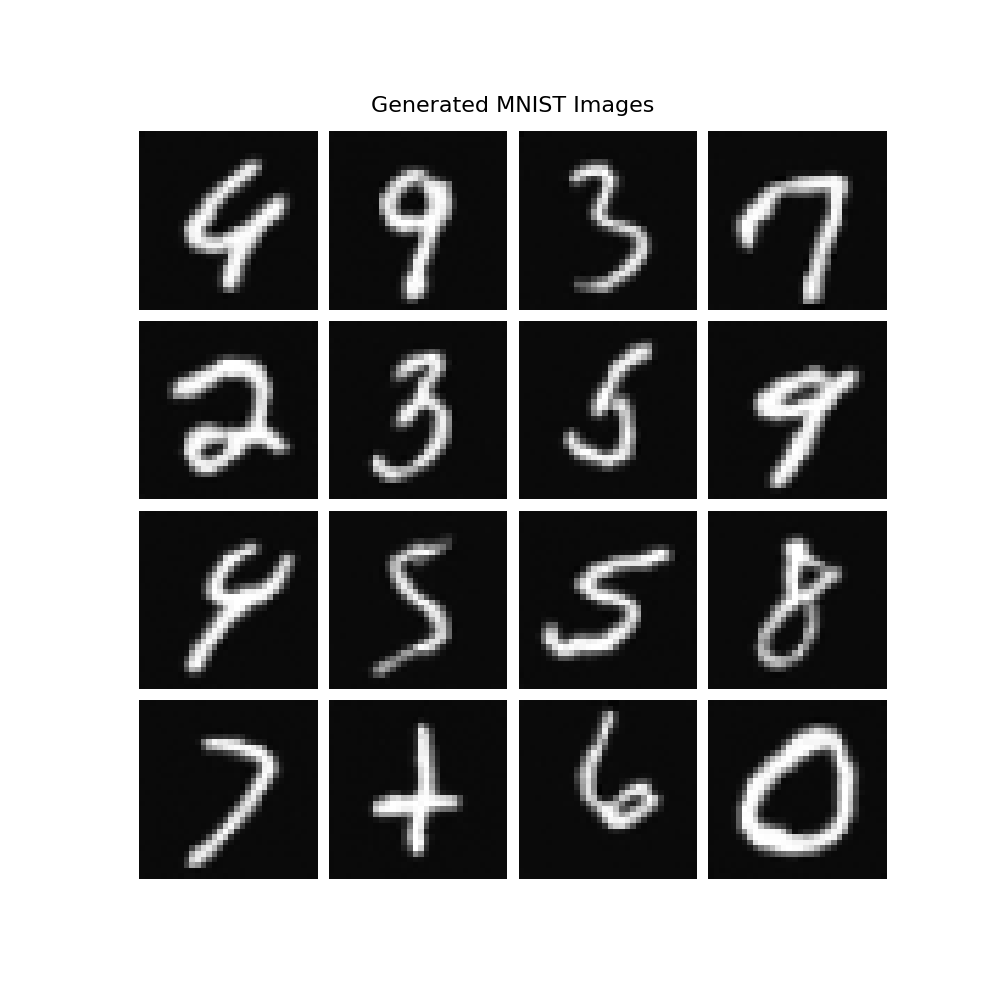

### VAE

#### pytorch
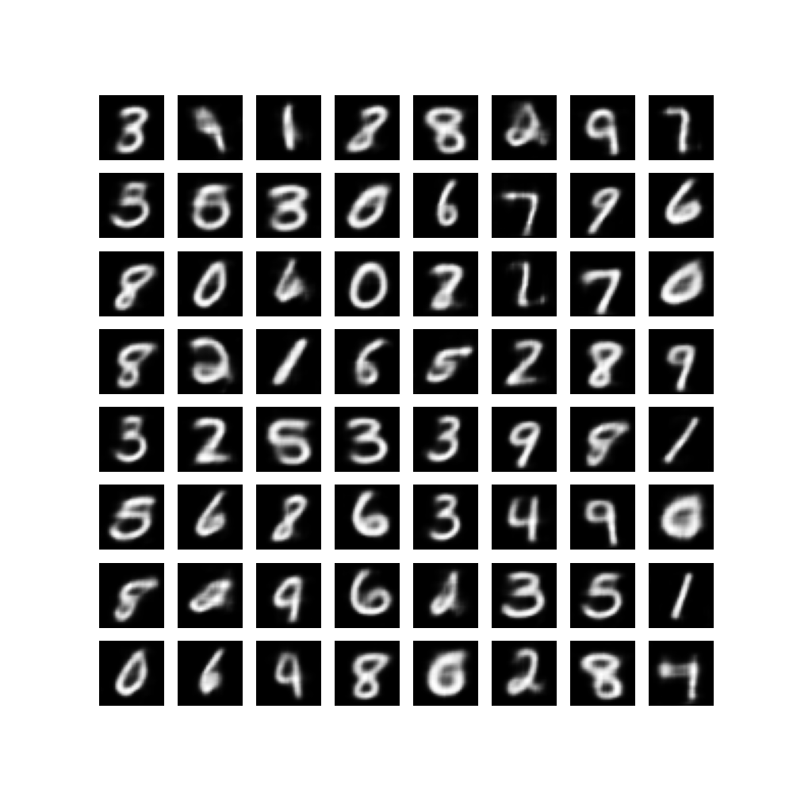
#### jittor
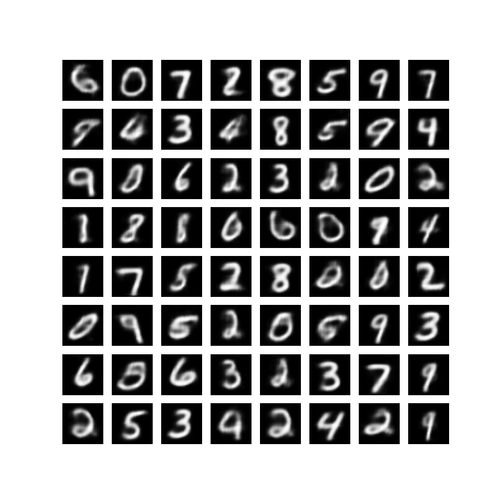
### LDM

#### pytorch
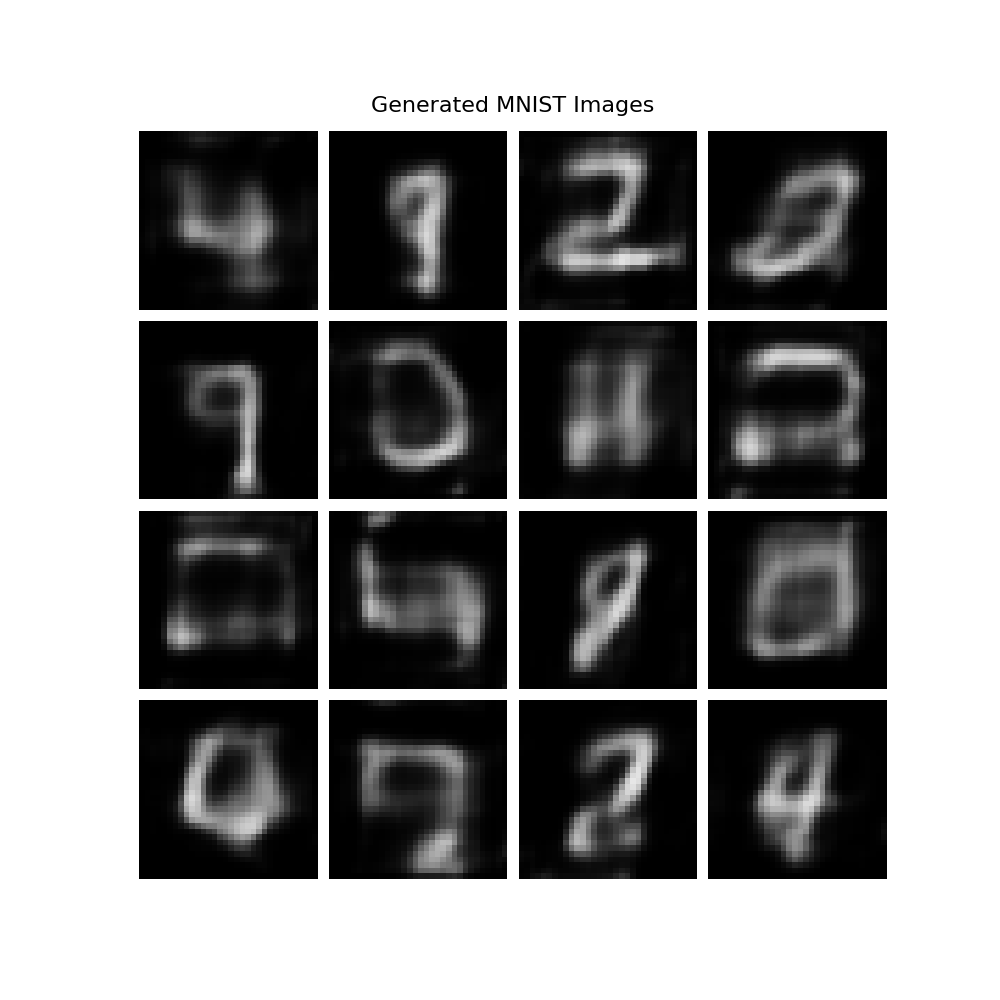
#### jittor
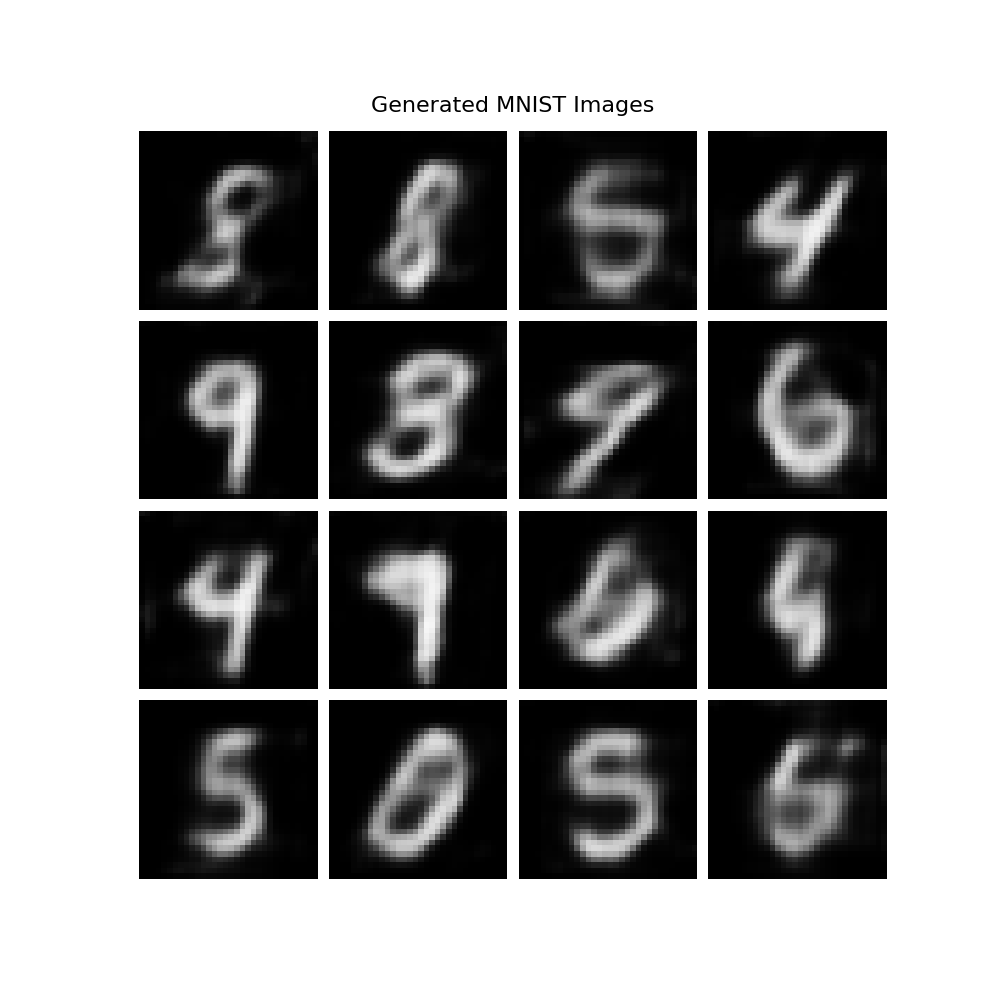


## 补充说明
对LDM的复现事实上不包含cross attention部分，仅仅实现了其中的感知压缩（Perceptual Impression）部分。


